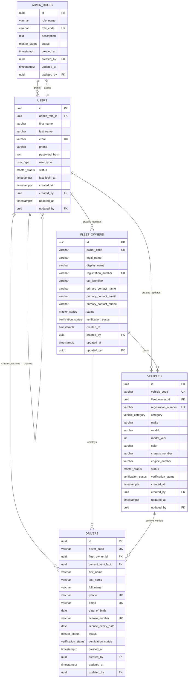

# Turrant Master Data ERD

Open this file in VS Code and use:

- `Cmd+Shift+V` on macOS
- `Ctrl+Shift+V` on Windows/Linux

to preview the diagram.

```mermaid
erDiagram
    ADMIN_ROLES {
        uuid id PK
        varchar role_name
        varchar role_code UK
        text description
        master_status status
        timestamptz created_at
        uuid created_by FK
        timestamptz updated_at
        uuid updated_by FK
    }

    USERS {
        uuid id PK
        uuid admin_role_id FK
        varchar first_name
        varchar last_name
        varchar email UK
        varchar phone
        text password_hash
        user_type user_type
        master_status status
        timestamptz last_login_at
        timestamptz created_at
        uuid created_by FK
        timestamptz updated_at
        uuid updated_by FK
    }

    FLEET_OWNERS {
        uuid id PK
        varchar owner_code UK
        varchar legal_name
        varchar display_name
        varchar registration_number UK
        varchar tax_identifier
        varchar primary_contact_name
        varchar primary_contact_email
        varchar primary_contact_phone
        master_status status
        verification_status verification_status
        timestamptz created_at
        uuid created_by FK
        timestamptz updated_at
        uuid updated_by FK
    }

    VEHICLES {
        uuid id PK
        varchar vehicle_code UK
        uuid fleet_owner_id FK
        varchar registration_number UK
        vehicle_category category
        varchar make
        varchar model
        int model_year
        varchar color
        varchar chassis_number
        varchar engine_number
        master_status status
        verification_status verification_status
        timestamptz created_at
        uuid created_by FK
        timestamptz updated_at
        uuid updated_by FK
    }

    DRIVERS {
        uuid id PK
        varchar driver_code UK
        uuid fleet_owner_id FK
        uuid current_vehicle_id FK
        varchar first_name
        varchar last_name
        varchar full_name
        varchar phone UK
        varchar email UK
        date date_of_birth
        varchar license_number UK
        date license_expiry_date
        master_status status
        verification_status verification_status
        timestamptz created_at
        uuid created_by FK
        timestamptz updated_at
        uuid updated_by FK
    }

    ADMIN_ROLES ||--o{ USERS : grants
    USERS ||--o{ USERS : creates
    USERS ||--o{ ADMIN_ROLES : audits
    USERS ||--o{ FLEET_OWNERS : creates_updates
    USERS ||--o{ VEHICLES : creates_updates
    USERS ||--o{ DRIVERS : creates_updates
    FLEET_OWNERS ||--o{ VEHICLES : owns
    FLEET_OWNERS ||--o{ DRIVERS : employs
    VEHICLES ||--o{ DRIVERS : current_vehicle
```
